

 
 
 
 
 
 
 
 

Goal:

> Conceptualize and measure populism in a way that takes into account the *multidimensionality* of the phenomenon.

---

class: inverse, center, middle

<iframe src="https://giphy.com/embed/3o6EQnG9JHIYCjUDny" width="480" height="359" frameBorder="0" class="giphy-embed" allowFullScreen></iframe>

## .. to get started?

---

class: inverse, center, middle

## Challenges & Shortcomings

---

## Challenges & Shortcomings

To study the populist phenomenon means...

--

to enter muddy waters.

--

 

**What is *populist* about populism?**

--

+ Organization?

--

+ Communication?

--

+ Ideology?

--
 

*All at once?*

--

 

=> Populism has a *"chameleonic"* character (Taggart 2000)

---

## Challenges & Shortcomings

1st Challenge: The never ending confusion

--

 

Populists are... 

--

right-wing. 

--

 

... <i>right?</i>

--

 

---

 
 
 
 
 
 
 

> *Cas Mudde has been influential in the literature, suggesting that populist philosophy is a loose set of ideas that share three core features: anti-establishment, authoritarianism, and nativism.* 

--

Inglehart & Norris (2016)

--

Mudde, C. (2007). Populist **radical right parties** in Europe (Vol. 22, No. 8). Cambridge: Cambridge University Press.

---

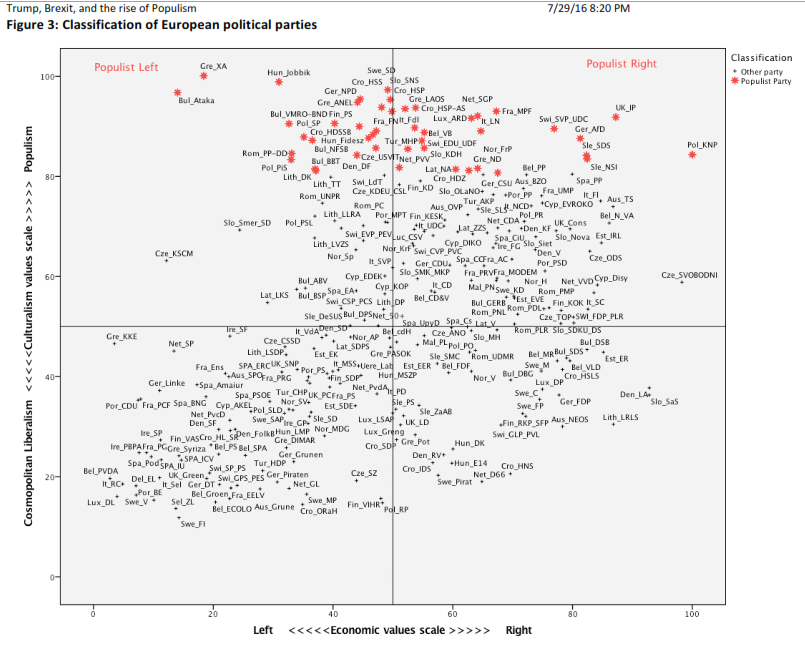

---

## Challenges & Shortcomings

Populism as a *thin centered ideology* (Mudde & Kaltwasser 2017):

--

+ Two groups: *"pure people"* vs. *"corrupt elites"*

--

+ Politics should express *"volonté générale"* 

--

 

**But who are *the people*?**

--

2nd Challenge: The variants of populism 

--

.center[

Left/Right?

]

--

.center[

Liberal/Illiberal?

]

--

.center[

... Progressive/Traditionalist.

]

---

class: inverse, center, middle

## Data & Methods

---

## Data & Methods

**CHES Dataset**

Positions of 218 political parties in 22 European countries on european and national policy issues.

--

**Minimalist Definition of Populism**

+ *Salience of anti-establishment and anti-elite rhetoric*
+ *Euroskepticism (attitudes towards European integration)*

--

**Progressive vs. Traditionalist Populism**

+ *Green-Alternative-Libertarian (GAL) and Traditional-Authoritarian-Nationalist (TAN)*
+ *Position on social lifestyle (e.g. homosexuality)*
+ *Position on civil liberties vs. law and order*

---

### Data & Methods

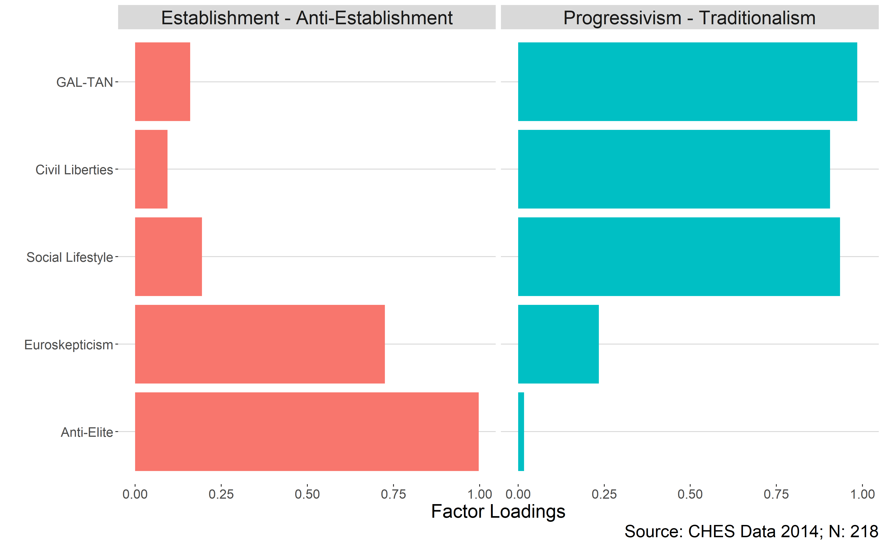

---

class: center, middle

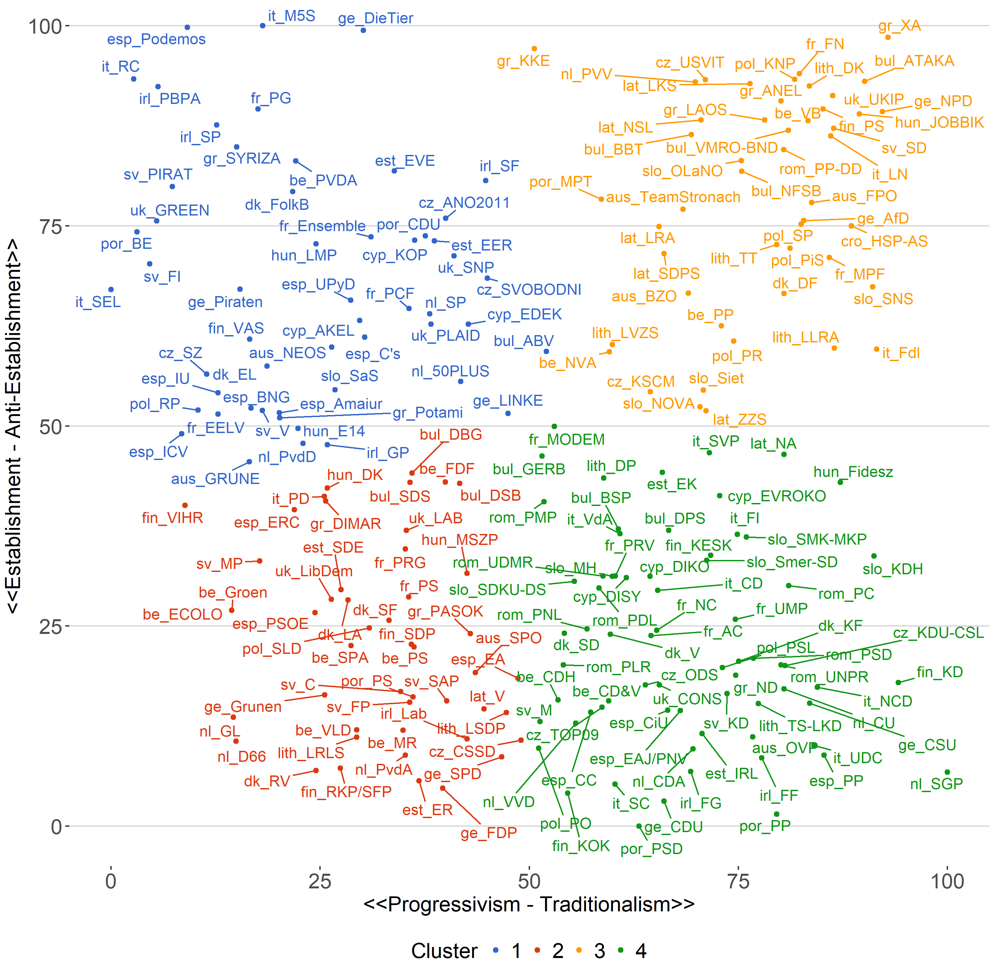

---

### Data & Methods

**Merging with ESS (Round 5-8: 2010-2016)**

Two variables will be used to measure our *dependent variable*:

1. What party did you vote for in the last national election?
2. Which party is closest to your views?

--

**Resulting DV has three categories:**

Support for Establishment/Traditionalist & Progressive Populist Parties 

--

**Multinomial Regression:**

Independent Variables: 

*Economic Insecurity, Unemployment, Welfare, Anti-Immigration Sentiment, Age, Education, Sex, Left-Right Scale, Religiosity, Government Satisfaction, Trust in Global Governance, Rural vs. Urban, Regional dummies (East, West, North and Southern Europe) and temporal dummies (2010, 2012, 2014 and 2016)*

**Total: 68.403 respondents in 22 countries**

---

class: inverse, center, middle

## Results

---

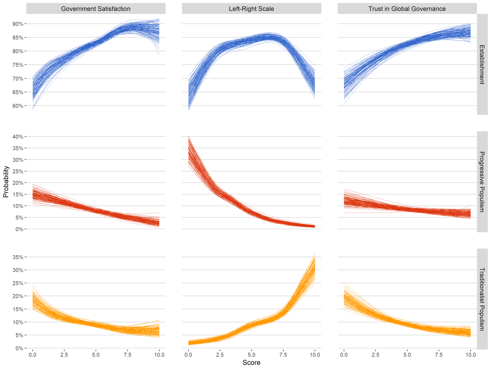

---

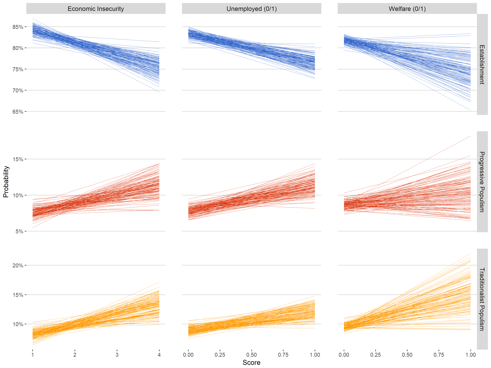

---

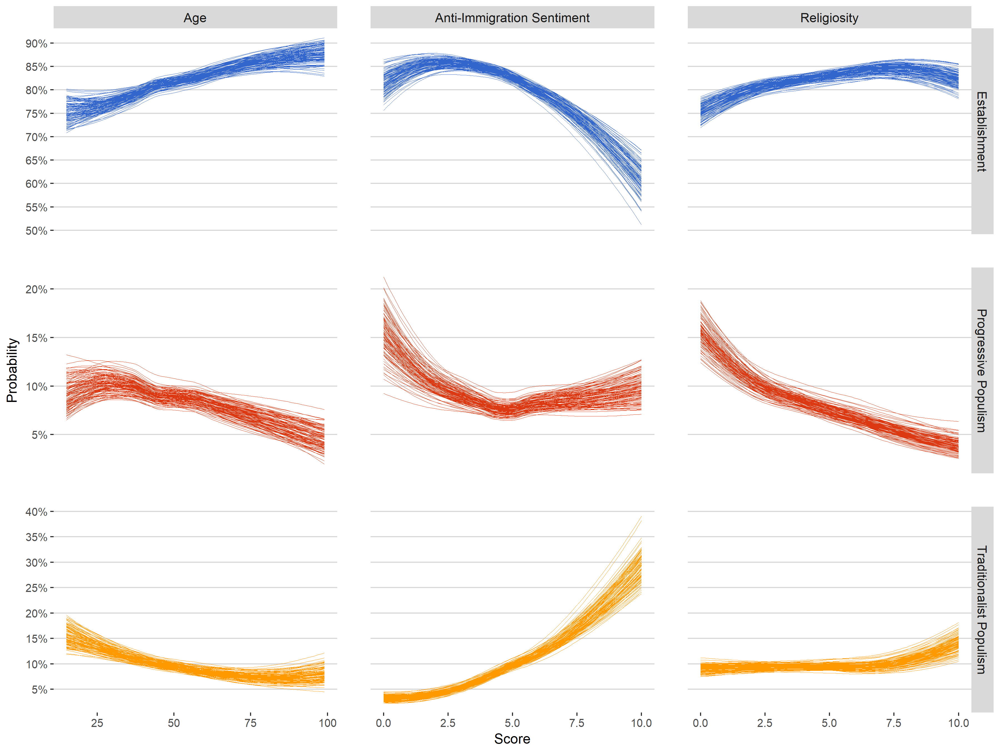

---

class: inverse, center, middle

## Conclusions

---

## Conclusions

+ Results of Inglehart & Norris 2016 could mostly be reproduced

+ Conceptualization/Classification seems to be appropriate
    + should be checked/validated by others in the future
    + Eastern European Communist parties may represent special cases
    
+ Many missing values (include non-aligned in multinomial model?)

+ Future research should take the *multidimensionality* of populism into account
    + specifically avoid conflating right-wing populism with populism

---

class: inverse, center, middle

## Thanks for Listening!

<!-- Full Paper: <a href='https://www.academia.edu/36656020/Deliberation_Across_the_World_A_Cross-National_Examination_of_the_Link_Between_Deliberation_and_Regime_Legitimacy'>Variants of Populism</a> -->

Slides: <a href='variants-of-populism.netlify.com'>https://variants-of-populism.netlify.com/ </a>

Code and Data on <a href='https://github.com/favstats/rise-of-populism'>GitHub</a>

---

## References

*Inglehart, R., & Norris, P. (2016). Trump, brexit, and the rise of populism: Economic have-notsand cultural backlash*

*Mudde, C., & Kaltwasser, C. R. (2017).Populism: A very short introduction. Oxford UniversityPress*

*Taggart, P. (2000). Populism. buckingham pa. Open University Press*

---

class: inverse, center, middle

## Appendix

---

class: center, middle

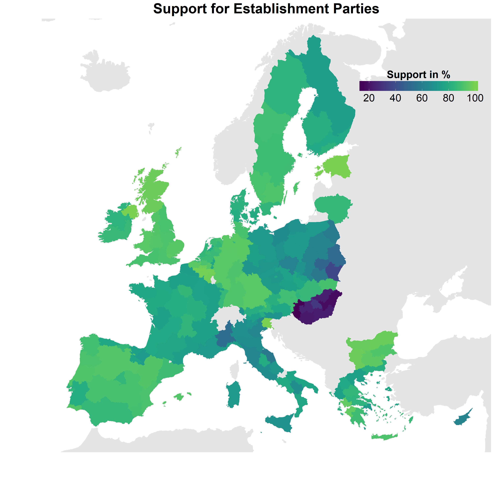

---

class: center, middle

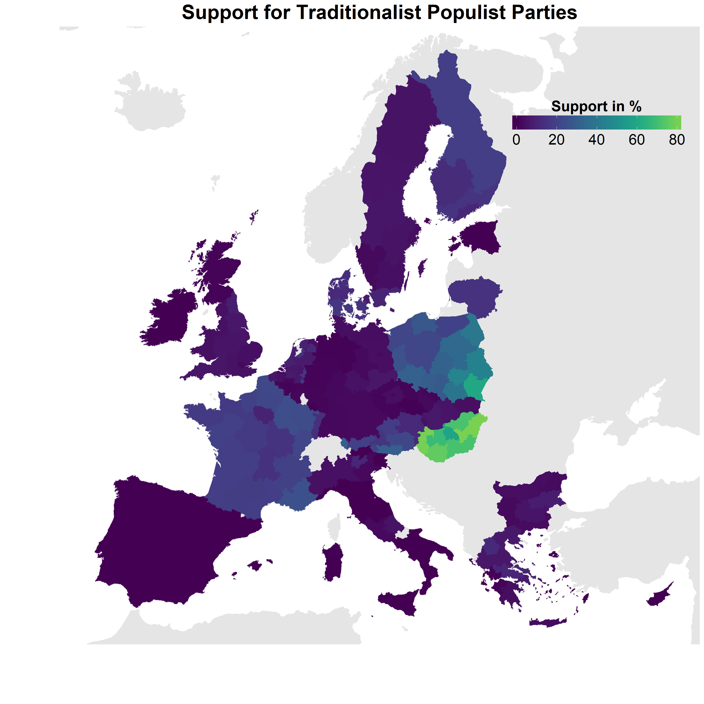

---

class: center, middle

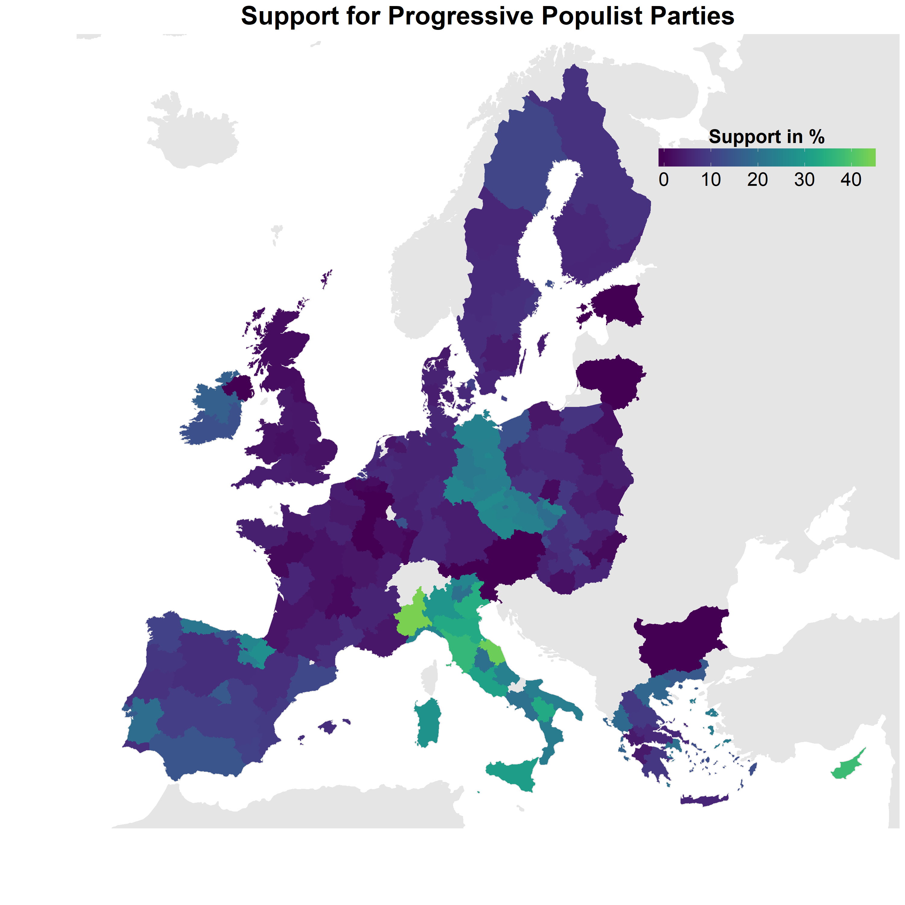

---

class: center, middle

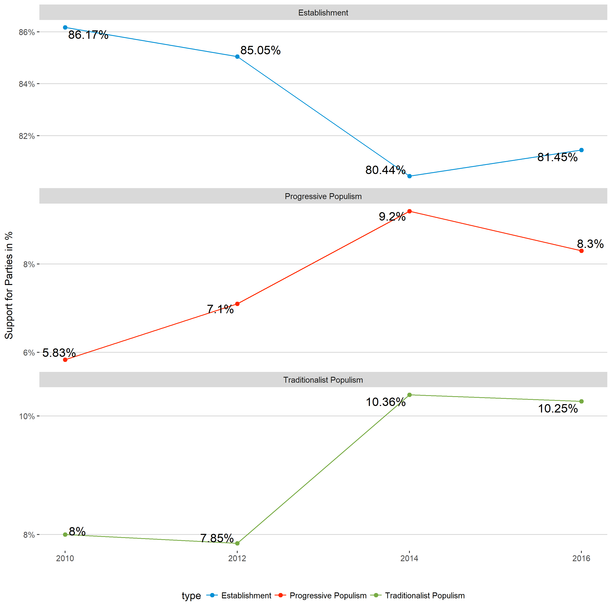

---

class: center, middle

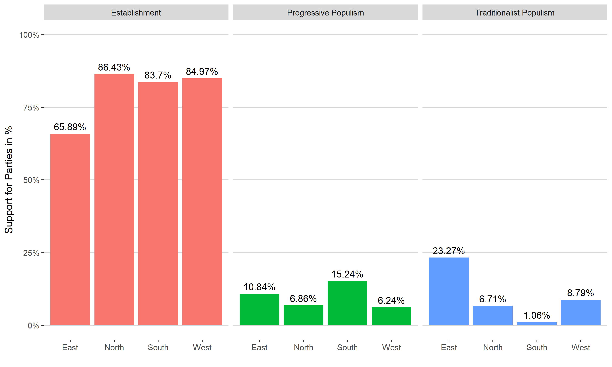

---

class: center, middle

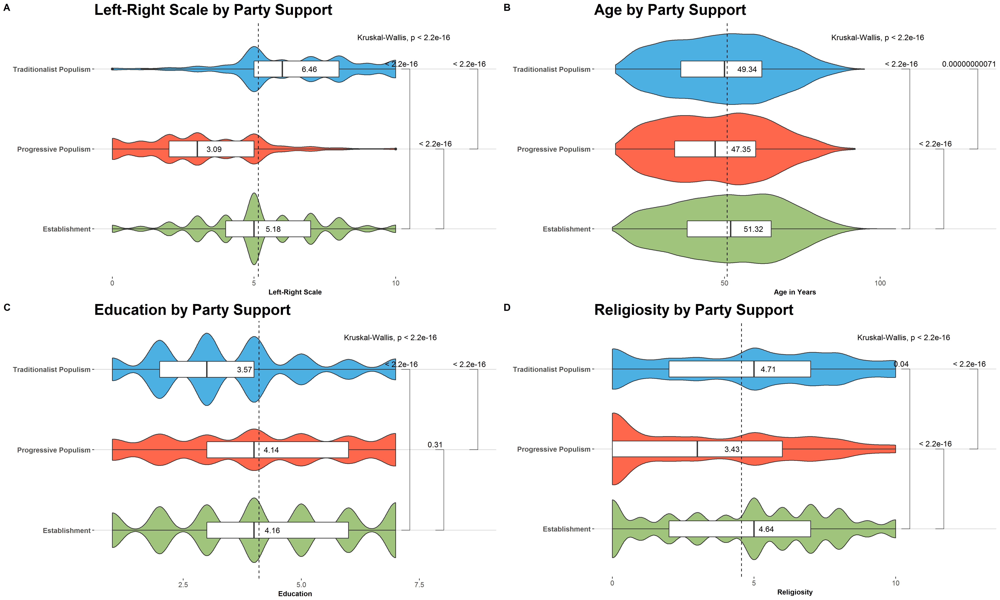

----

